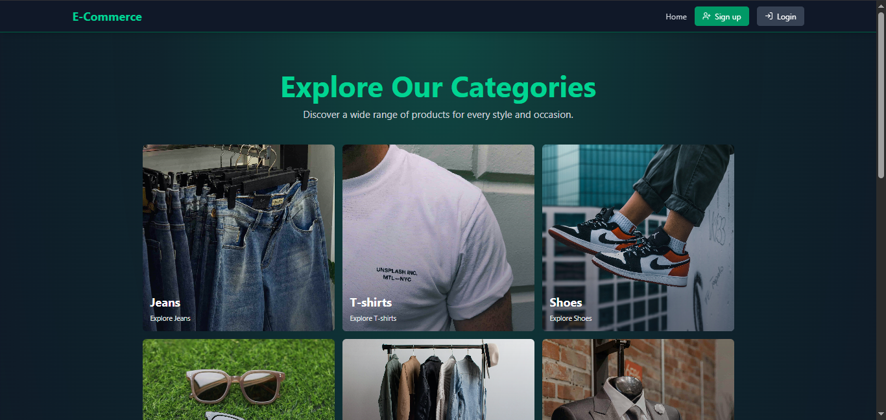

# E-Commerce Platform

A full-stack e-commerce application built with the MERN stack (MongoDB, Express, React, Node.js).



## Features

- 🔐 User authentication and authorization with JWT
- 🛍️ Product browsing, search, and filtering
- 🛒 Shopping cart management
- 💳 Secure checkout and payment processing
- 📦 Order history and tracking
- 👨‍💼 Admin dashboard for product and order management
- 📱 Responsive design for all devices
- 🔄 Real-time updates and notifications
- 📊 Analytics and reporting
- 🎁 Gift coupons and promotions

## Tech Stack

### Frontend
- React.js
- React Router for navigation
- Styled Components/CSS modules/Tailwind CSS
- Axios for API requests
- Form validation libraries
- Zustand for global function

### Backend
- Node.js
- Express.js
- MongoDB with Mongoose ODM
- JWT for authentication
- Redis for token database
- Bcrypt for password hashing
- Cloudinary for image uploads
- Payment gateway integration

## Prerequisites

Before running this application, make sure you have the following installed:
- Node.js (v14 or higher)
- MongoDB
- npm or yarn

## Installation & Setup

1. Clone the repository
```bash
git clone https://github.com/paulustimothy/ecommerce-mern.git
cd ecommerce
```

2. Install backend dependencies
```bash
npm install
```

3. Install frontend dependencies
```bash
cd frontend
npm install
```

4. Environment variables
Create a `.env` file in the root directory with necessary variables:
```env
# Server Configuration
NODE_ENV=development
PORT=5000
FRONTEND_URL=http://localhost:5173

# Database
MONGO_URI=your_mongodb_connection_string
REDIS_URI=your_redis_secret_key

# Cloudinary Configuration
CLOUDINARY_CLOUD_NAME=your_cloudinary_name
CLOUDINARY_API_KEY=your_cloudinary_key
CLOUDINARY_API_SECRET=your_cloudinary_secret

# Authentication
JWT_SECRET=your_jwt_secret
ACCESS_TOKEN_SECRET=uptou
REFRESH_TOKEN_SECRET=terserah

# Payment Gateway
STRIPE_SECRET_KEY=your_stripe_secret_key
```

## Running the Application

### Development Mode

1. Start the backend server:
```bash
# From the root directory
npm run dev
```

2. Start the frontend development server:
```bash
# From the frontend directory
cd frontend
npm run dev
```

The frontend will be available at `http://localhost:5173`
The backend API will be available at `http://localhost:5000/api`

### Production Mode

To build and run the application in production mode:

```bash
# Build the frontend
cd frontend
npm run build

# Start the production server from the root directory
cd ..
npm start
```

Special thanks to Codesistency
